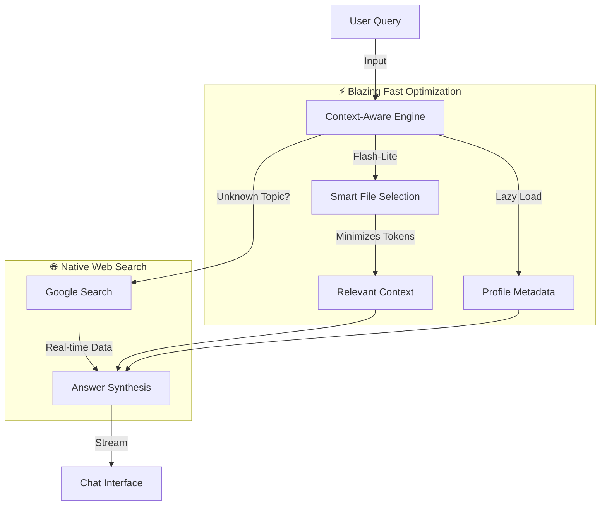

# RepoMind


<div align="center">

[](https://github.com/403errors/repomind)
[](https://opensource.org/licenses/MIT)
[](https://nextjs.org/)
[](https://ai.google.dev/)
[](https://ai.google.dev/)

**[Try RepoMind now!](https://repomind-ai.vercel.app)** 

**[Ask RepoMind about RepoMind :3](https://repomind-ai.vercel.app/chat?q=403errors/repomind)**

</div>

---

**RepoMind** is a free, AI-powered application using Agentic CAG to chat with any public GitHub repository or developer profile. Using an advanced **Context-Aware Engine**, RepoMind performs deep code analysis without requiring you to clone repositories.

> **Stop reading code. Start talking to it.** 🚀

## ✨ Features

### 🧠 Context-Aware Engine
- **Smart Context Loading**: Instead of dumping entire files, RepoMind intelligently selects relevant code snippets based on your query.
- **Noise Filtering**: Automatically ignores `node_modules`, lockfiles, and build artifacts to focus on source code.
- **Multi-File Understanding**: Traces dependencies and imports to understand how different parts of the codebase interact.

### 🧠 CAG vs RAG: The Architecture
RepoMind uses **Context Augmented Generation (CAG)**, not traditional RAG. We don't chop your code into fragmented vectors; we load full, relevant files into the model's long context window for superior understanding.

| Feature | Traditional RAG | 🧠 RepoMind (CAG) |
| :--- | :--- | :--- |
| **Data Unit** | Small Chunks (Vectors) | **Full Files** |
| **Retrieval** | Similarity Search (Vector DB) | **AI Agent Selection** + **Smart Caching** |
| **Context** | Fragmented | **Coherent & Complete** |
| **Memory** | None (Stateless) | **KV Cache** (Remembers relevant files) |

### 🔄 Workflow Architecture



### 📈 Evolution & Updates
We are constantly improving RepoMind. Check out our **[CHANGELOG.md](CHANGELOG.md)** for the full history of updates, including our journey from v1 to the latest **v1.3.2**.

### 📊 Visual Architecture Maps
- **Auto-Generated Diagrams**: Instantly turn complex code logic into clear Mermaid flowcharts and sequence diagrams.
- **Interactive Zoom/Pan**: Explore large diagrams with intuitive controls.
- **Export Options**: Save diagrams as images for documentation or presentations.

### 👤 Deep Profile Intelligence (USP)
- **Developer Fingerprinting**: Analyze coding style, commit patterns, and language preferences of any GitHub user.
- **Cross-Repo Context**: Aggregate knowledge from multiple repositories to understand a developer's full skillset.
- **Resume Generation**: Create instant technical summaries for any developer profile.

### 🛡️ Zero-Config Security Audits
- **Vulnerability Scanning**: Detect SQL injections, XSS, and auth flaws without setting up CI/CD pipelines.
- **AI-Powered Triage**: Get context-aware explanations of *why* code is vulnerable, not just static alerts.
- **Fix Recommendations**: Receive copy-pasteable code patches to resolve security issues.

### 📱 Mobile-First Experience
- **Analyze on the Go**: The only advanced code analysis tool optimized for mobile browsers.
- **Touch-Friendly Interface**: Swipe, tap, and zoom through codebases on your phone or tablet.
- **Responsive DevTools**: Access full debugging and search capabilities from anywhere.

### 🔍 Semantic Code Search
- **Natural Language Search**: "Find where user authentication happens"
- **Regex & AST Search**: Power-user tools for precise structural code matching.
- **Instant Navigation**: Jump directly to relevant lines across thousands of files.

## 🆚 RepoMind vs The Market

RepoMind is designed for **instant, zero-setup analysis**. While other tools require installation or permissions, RepoMind works immediately in your browser.

| Feature | 🧠 RepoMind | 🐙 GitHub Copilot (Web) | 🦎 Greptile | 🚢 Onboard AI |
| :--- | :---: | :---: | :---: | :---: |
| **Platform** | **🌐 Web (Any Browser)** | 🌐 Web (GitHub.com) | 🌐 Web Dashboard | 🌐 Web Dashboard |
| **Access** | **⚡ Instant (Public URL)** | Requires Repo Access | Requires App Install | Requires App Install |
| **Pricing** | **💸 100% Free** | Enterprise / Paid | Paid (Free Tier) | Paid (Free Tier) |
| **Visual Maps** | **✅ Auto-Flowcharts** | ❌ No | ❌ No | ❌ No |
| **Profile Insights** | **✅ Developer Analysis** | ❌ No | ❌ No | ❌ No |
| **Mobile UX** | **✅ Mobile-First** | ⚠️ Desktop Focused | ❌ Desktop Only | ❌ Desktop Only |
| **Security Scan** | **✅ Free AI Audit** | ✅ (Advanced Security) | ❌ No | ❌ No |
| **Tech Stack** | **Context-Aware** | Indexed Search | Proprietary Index | Vector Search |

### 🎯 Why RepoMind?

**1. The "Just Works" Factor**
Competitors like **Greptile** and **Onboard AI** require you to install GitHub Apps, grant permissions, and wait for indexing. **RepoMind** works instantly on any public repository URL. No login or installation required to start.

**2. Visuals > Text**
**GitHub Copilot** and **Onboard AI** give you walls of text. RepoMind generates **interactive flowcharts** and diagrams, helping you visualize the code's architecture instantly.

**3. Mobile Freedom**
RepoMind is the only tool in this class built with a **mobile-first** philosophy. Debug code, review PRs, or learn a new library from your phone while commuting.

**4. Profile Intelligence**
We don't just analyze code; we analyze **coders**. RepoMind is the only platform that aggregates data across a developer's entire portfolio to give you a "resume-style" analysis of their skills and habits.

## 🚀 Getting Started

### Prerequisites
- **Node.js** 18+ and npm
- **GitHub Personal Access Token** ([Create one here](https://github.com/settings/tokens))
- **Google Gemini API Key** ([Get one here](https://ai.google.dev/))

### Installation

1. **Clone the repository**
   ```bash
   git clone https://github.com/403errors/repomind.git
   cd repomind
   ```

2. **Install dependencies**
   ```bash
   npm install
   ```

3. **Set up environment variables**
   ```bash
   cp .env.example .env.local
   ```
   
   Edit `.env.local` and add your keys:
   ```env
    # GitHub Token
    GITHUB_TOKEN="your_github_token"

    # Gemini API Key
    GEMINI_API_KEY="your_gemini_api_key"

    #Caching Vercel KV
    KV_REST_API_READ_ONLY_TOKEN="your_kv_rest_api_read_only_token"
    KV_REST_API_TOKEN="your_kv_rest_api_token"
    KV_REST_API_URL="your_kv_rest_api_url"
    KV_URL="your_kv_url"
    REDIS_URL="your_redis_url"
   ```

4. **Run the development server**
   ```bash
   npm run dev
   ```

5. **Open the app**
   
   Visit [http://localhost:3000](http://localhost:3000) in your browser

## 📖 Usage Examples

### Analyze a Repository
```
Enter: "facebook/react"
Ask: "How does the reconciliation algorithm work?"
Ask: "Find all lifecycle methods"
Ask: "Show me the file tree structure"
```

### Explore a Developer Profile
```
Enter: "torvalds"
Ask: "What languages does Linus primarily use?"
Ask: "Show me his most recent projects"
Ask: "What's his coding style like?"
```

### Security Scanning
```
Enter: "your-org/your-repo"
Open DevTools → Security Scan
Review vulnerabilities by severity
Get actionable fix recommendations
```

### Code Quality Check
```
Open DevTools → Quality Analysis
Select a file to analyze
View complexity metrics and issues
Get improvement suggestions
```

### Advanced Search
```
Open DevTools → Search
Search for "useState" (Text)
Search for "function.*async" (Regex)
Search for functions named "handle" (AST)
```

## 🛠️ DevTools Features

RepoMind includes a powerful DevTools panel accessible via the wrench icon:

### 🔍 Search
- **Text Search**: Fast string matching with case sensitivity options
- **Regex Search**: Complex pattern matching with full regex support
- **AST Search**: Structural search for functions, classes, variables, imports
- **Results**: File paths, line numbers, code snippets with context

### ✅ Quality Analysis
- **Metrics**: Cyclomatic complexity, LOC, function count, maintainability index
- **AI Review**: Gemini-powered analysis for style, bugs, best practices
- **Severity Levels**: Critical, high, medium, low issue classification
- **Suggestions**: Actionable recommendations with line numbers

### ⚡ Generators
- **Documentation**: Auto-generate comprehensive docs for any file
- **Test Generation**: Create unit tests based on code structure
- **Refactoring**: Get AI suggestions for improving code quality

### 💬 Help
- Quick reference guide
- Keyboard shortcuts
- Feature explanations

## 🔒 Privacy & Security

- **GitHub Token**: Stored locally in your browser, never sent to our servers
- **API Keys**: Environment variables, not exposed to client
- **No Data Storage**: Conversations are ephemeral (optional KV cache for performance)
- **Server-Side Processing**: AI analysis happens on Vercel Edge, not client-side
- **Open Source**: Audit the code yourself

## 🤝 Contributing

We welcome contributions! Here's how you can help:

1. **Fork the repository**
2. **Create a feature branch**: `git checkout -b feature/amazing-feature`
3. **Commit your changes**: `git commit -m 'Add amazing feature'`
4. **Push to the branch**: `git push origin feature/amazing-feature`
5. **Open a Pull Request**

### Development Guidelines
- Follow existing code style
- Write meaningful commit messages
- Update documentation for new features
- Test on multiple screen sizes

## 📄 License

This project is licensed under the MIT License - see the [LICENSE](LICENSE) file for details.

## 🙏 Acknowledgments

Built with amazing open-source technologies:
- [Next.js](https://nextjs.org/) - React framework
- [Google Gemini](https://ai.google.dev/) - AI model
- [Vercel](https://vercel.com/) - Hosting and KV storage
- [GitHub](https://github.com/) - Repository data
- [Tailwind CSS](https://tailwindcss.com/) - Styling
- [Framer Motion](https://www.framer.com/motion/) - Animations
- [Mermaid](https://mermaid.js.org/) - Diagrams

---

<div align="center">

**Made with ❤️ by [403errors](https://github.com/403errors)**

[⭐ Star on GitHub](https://github.com/403errors/repomind) • [🐛 Report Bug](https://github.com/403errors/repomind/issues) • [✨ Request Feature](https://github.com/403errors/repomind/issues)

</div>
