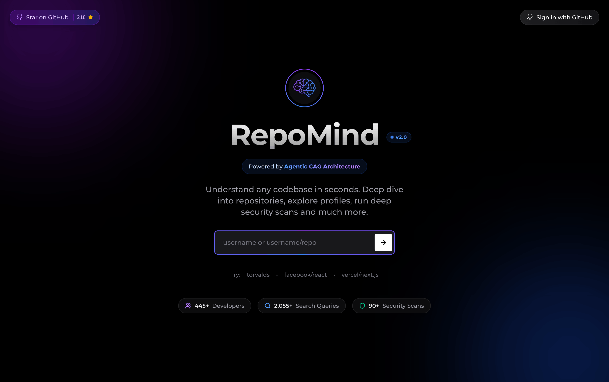
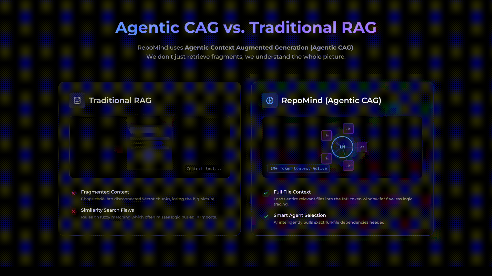
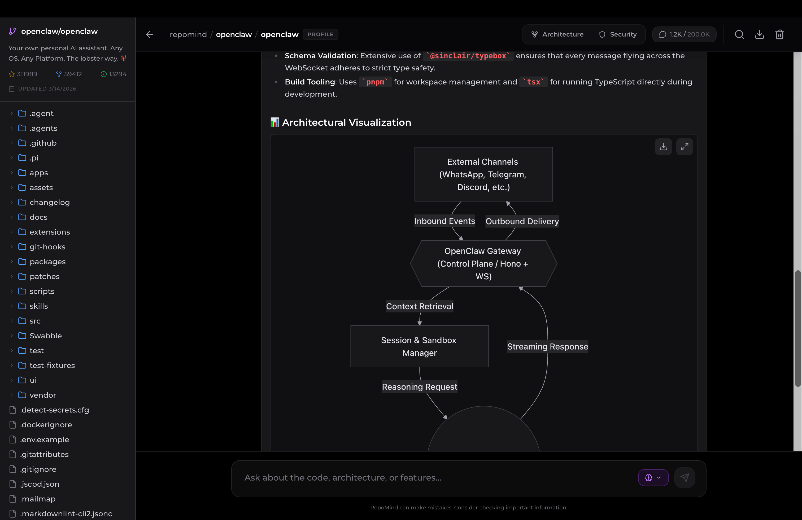
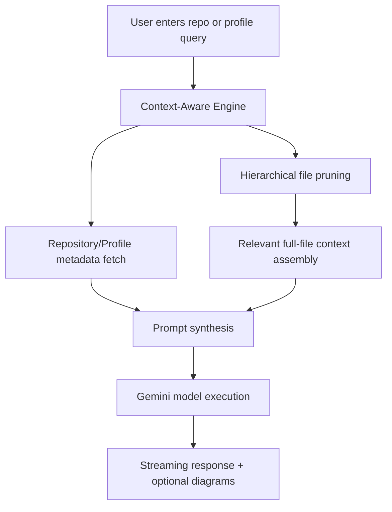
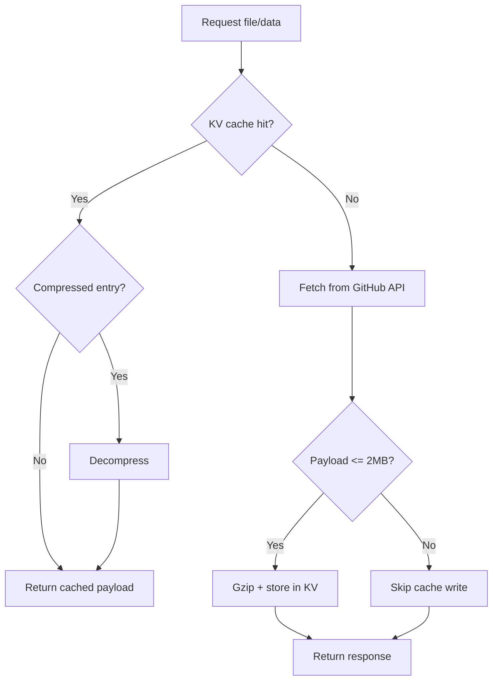
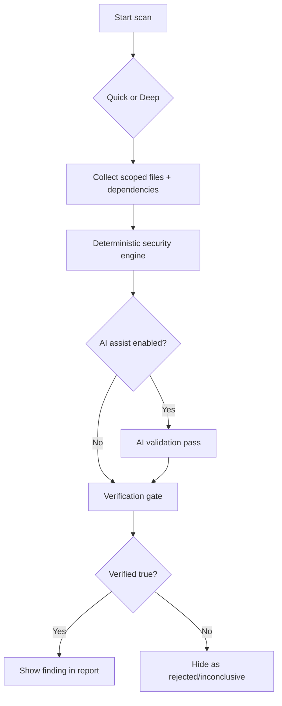
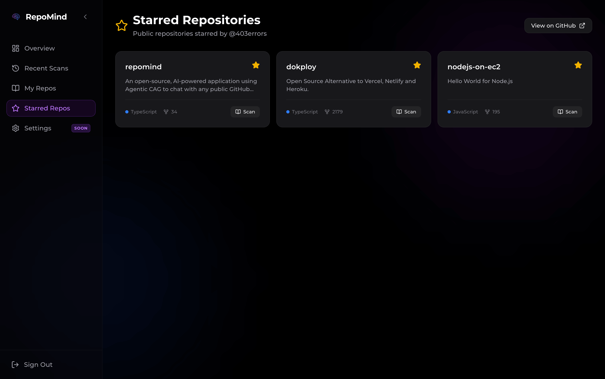

# RepoMind

<p align="center"><strong>Stop reading code. Start talking to it.</strong></p>

<p align="center">
  <a href="https://github.com/403errors/repomind"></a>
  <a href="https://opensource.org/licenses/MIT"></a>
  <a href="https://nextjs.org/"></a>
  <a href="https://ai.google.dev/"></a>
</p>

<p align="center">
  <a href="https://repomind.in"><strong>Try RepoMind Live</strong></a>
  ·
  <a href="https://repomind.in/repo/facebook/react"><strong>See React Analyzed</strong></a>
  ·
  <a href="https://github.com/403errors/repomind/issues"><strong>Contribute</strong></a>
</p>


RepoMind is an open-source, AI-powered platform for understanding public GitHub repositories and developer profiles with **Agentic CAG**. It combines deep code reasoning, architecture visualization, and security scanning into a fast, browser-first experience.

## Why RepoMind

- **Zero setup for public repos**: paste a repo or profile and start immediately.
- **Context-aware analysis**: selects full, relevant files instead of fragmented vector chunks.
- **Visual understanding**: generates architecture maps and flow diagrams for faster onboarding.
- **Security scanning built in**: quick/deep scans with verification-focused reporting.
- **Contributor-friendly codebase**: clear TypeScript services, tests, and modular features.

## Product Highlights

### Landing Experience



### Repo Profile Intelligence


### Core Capabilities


## Agentic CAG Architecture

RepoMind uses **Agentic Context-Augmented Generation (CAG)**. Instead of relying only on embeddings, it prunes and loads coherent source context to answer architecture and implementation questions reliably.





## Architecture Flowcharts

These diagrams provide a quick mental model of how RepoMind processes queries, optimizes performance, and validates security findings.

### 1) Query + Context Pipeline


```mermaid
graph TD
    A[User enters repo or profile query] --> B[Context-Aware Engine]
    B --> C[Repository/Profile metadata fetch]
    B --> D[Hierarchical file pruning]
    D --> E[Relevant full-file context assembly]
    C --> F[Prompt synthesis]
    E --> F
    F --> G[Gemini model execution]
    G --> H[Streaming response + optional diagrams]
```

### 2) Caching + Retrieval Strategy


```mermaid
graph TD
    A[Request file/data] --> B{KV cache hit?}
    B -->|Yes| C{Compressed entry?}
    C -->|Yes| D[Decompress]
    C -->|No| E[Return cached payload]
    D --> E
    B -->|No| F[Fetch from GitHub API]
    F --> G{Payload <= 2MB?}
    G -->|Yes| H[Gzip + store in KV]
    G -->|No| I[Skip cache write]
    H --> J[Return response]
    I --> J
```

### 3) Security Scan + Verification Flow


```mermaid
graph TD
    A[Start scan] --> B{Quick or Deep}
    B --> C[Collect scoped files + dependencies]
    C --> D[Deterministic security engine]
    D --> E{AI assist enabled?}
    E -->|Yes| F[AI validation pass]
    E -->|No| G[Verification gate]
    F --> G
    G --> H{Verified true?}
    H -->|Yes| I[Show finding in report]
    H -->|No| J[Hide as rejected/inconclusive]
```

## Security Scanning

RepoMind includes a verification-first scanning flow for application and dependency risks.

- Quick scan for fast triage
- Deep scan for broader coverage
- Verified-first reporting pipeline
- Actionable fixes inside repo chat flow


## Dashboard Experience




## Getting Started

### Use Hosted App

1. Open [repomind.in](https://repomind.in)
2. Enter `owner/repo` or a GitHub username
3. Ask architecture, code, or security questions

### Run Locally

#### Prerequisites

- Node.js 18+
- npm
- GitHub token
- Gemini API key

#### Setup

```bash
git clone https://github.com/403errors/repomind.git
cd repomind
npm install
cp .env.example .env.local
npm run dev
```

Open [http://localhost:3000](http://localhost:3000).

### Developer Commands

```bash
npm run dev            # local dev server
npm run lint           # lint checks
npm run test           # test suite
npm run test:security  # security-focused tests
npm run build          # production build
```

## Contributing

We want RepoMind to be one of the best OSS projects for AI-assisted code intelligence. Contributions of all sizes are welcome.

### Why contribute

- Work on practical agentic AI for real repositories
- Improve developer tooling used by public users
- Ship visible features quickly with direct product impact

### High-Impact Areas

- **Query pipeline and reasoning quality**: improve file selection, prompting, and response quality
- **Security scanner and verification**: improve detection accuracy and reduction of false positives
- **Dashboard and DevTools UX**: improve discoverability, workflows, and performance
- **Docs, tests, and reliability**: strengthen onboarding and confidence for contributors

### Contribution Workflow

1. Fork the repository
2. Create a branch: `git checkout -b feature/your-change`
3. Make focused changes with tests
4. Run `npm run lint` and `npm run test`
5. Open a pull request with context, screenshots, and validation notes

### Pull Request Expectations

- Keep scope clear and reviewable
- Add or update tests when behavior changes
- Update docs when introducing user-visible changes
- Include before/after screenshots for UI work

## Changelog

Recent major updates are tracked in [CHANGELOG.md](CHANGELOG.md), including improvements through **v1.3.6 (2026-02-23)**.

## Tech Stack

- [Next.js](https://nextjs.org/)
- [React](https://react.dev/)
- [Gemini](https://ai.google.dev/)
- [Prisma](https://www.prisma.io/)
- [Vercel KV](https://vercel.com/docs/storage/vercel-kv)
- [Vitest](https://vitest.dev/)

## License

Licensed under the MIT License. See [LICENSE](LICENSE).

---

<p align="center">
  Built by <a href="https://github.com/403errors">403errors</a> ·
  <a href="https://github.com/403errors/repomind">Star on GitHub</a> ·
  <a href="https://github.com/403errors/repomind/issues">Report Issue</a>
</p>
